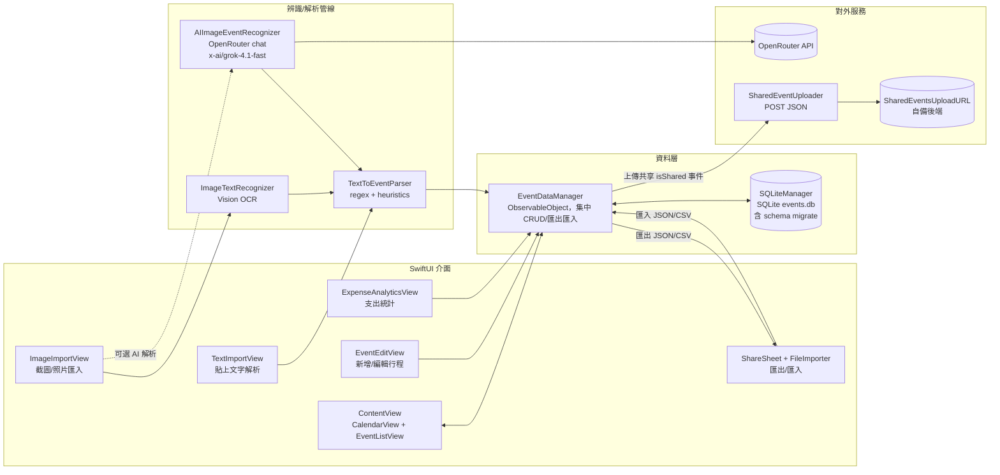

# Dimian 系統架構圖

從專案原始碼（`ContentView`, `EventDataManager`, `SQLiteManager`, `TextToEventParser`, `ImageTextRecognizer`, `AIImageEventRecognizer`, `SharedEventUploader` 等）萃取的整體資料流如下。

### 流程重點
- `ContentView` 聚合日曆、列表、圖表、匯入/匯出按鈕；所有操作都透過 `EventDataManager`。
- `EventDataManager` 封裝 CRUD、JSON/CSV 匯入匯出，並以 `SQLiteManager` 永久化至 `events.db`，啟動時載入資料或示例數據。
- 文字匯入：`TextImportView` 觸發 `TextToEventParser` 解析日期/時間/金額/類別，輸出 `Event` 寫回資料層。
- 圖像匯入：`ImageImportView` 先跑 Vision OCR（`ImageTextRecognizer`），再交給 `TextToEventParser`；可選用 `AIImageEventRecognizer` 走 OpenRouter 取得結構化 JSON 後與本地結果整併。
- 共享上傳：`EventDataManager` 抽取當日 `isShared` 事件，交給 `SharedEventUploader` 轉 JSON 並 POST 至 `SharedEventsUploadURL`。
- 匯出/分享：資料層可輸出單日 JSON、全部 CSV，再由 `ShareSheet` 分享；`FileImporter` 支援 JSON/CSV 回填資料庫。
